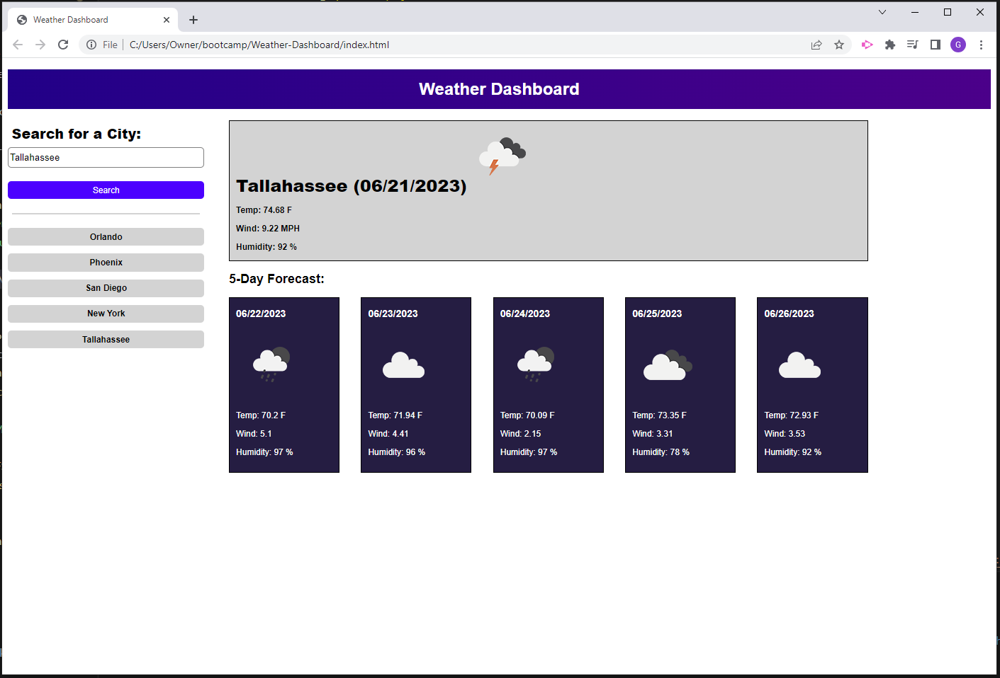

# Weather Forecast Dashboard 

## Description
This application allows the user to search any city and find current weather information, as well as a five day weather forecast.
## Deployed Application URL
https://geoffwithers.github.io/Weather-Dashboard/
## Screenshot

## Table of Contents
* [Features](#features)
* [Languages & Dependencies](#languagesanddependencies)
* [How to Use This Application](#HowtoUseThisApplication)
* [Contributors](#contributors)
* [Testing](#testing)
* [Questions](#questions)
## Features
This project links to openweather.org's API, and saves a history of your past searches.
## Languages & Dependencies
N/A
## How to Use This Application:
HTML, CSS, JavaScript, APIs, jquery
## Contributors
N/A
## Testing
N/A
## Questions
Please send your questions [here](mailto:geoffwithers91@gmail.com?subject=[GitHub]%20Dev%20Connect) or visit [github/geoffwithers](https://github.com/geoffwithers).
